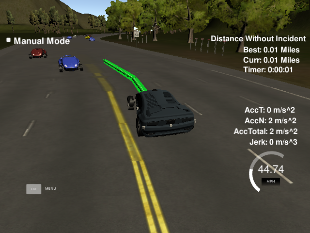
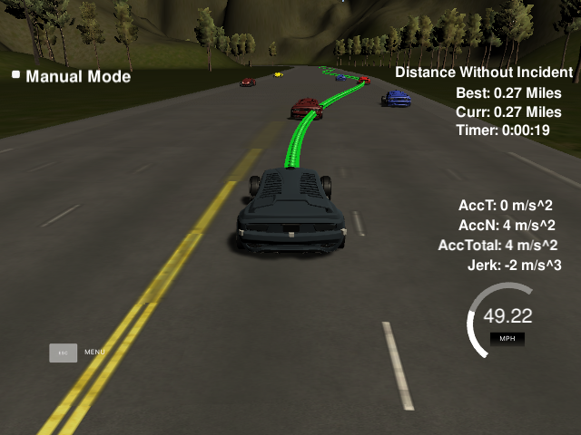

# CarND-Path-Planning-Project
Self-Driving Car Engineer Nanodegree Program

## 1. Modify the way points
It is found that the original way points are sparse. Therefore, the generated way points leads to non-smooth mapping 
between [s,d] and [x,y]. This would further leads to speed, acceleration, and jerk conflict.

### 1.1. interpolate original way points using [spline tool](http://kluge.in-chemnitz.de/opensource/spline/)
```
tk::spline s_x, s_y, s_dx, s_dy;
s_x.set_points(map_waypoints_s,map_waypoints_x);
s_y.set_points(map_waypoints_s,map_waypoints_y);
s_dx.set_points(map_waypoints_s,map_waypoints_dx);
s_dy.set_points(map_waypoints_s,map_waypoints_dy);
```
```
for(int i=0;i<2000;i++) {
    double temp_s = car_s + 0.4*(double)(i);
    double temp_d = 6+4*sin(M_PI*(double)i/150);
    next_x_vals.push_back(s_x(temp_s) + temp_d*s_dx(temp_s));
    next_y_vals.push_back(s_y(temp_s) + temp_d*s_dy(temp_s));
    if(i==0) {
        next_s_vals.push_back(car_s);
    }
    else {
        double delta_s = distance(next_x_vals[i],next_y_vals[i],next_x_vals[i-1],next_y_vals[i-1]);
        next_s_vals.push_back(next_s_vals[i-1]+delta_s);
    }
}
```
The path is much smoother than before. However, it seems that the way point is not evenly distributed. This would cause 
speed fluctuation.

### 1.2. rescale way points and path points
To tackle the above problem, I will recalculate map_waypoint_s according to map_waypoint_x and map_waypoint_y. This 
trickis also used in path generation.

#### 1.2.1. Modify the way points
```
double s_max = *max_element(begin(map_waypoints_s),end(map_waypoints_s));
map_waypoints_x.clear();
map_waypoints_y.clear();
map_waypoints_dx.clear();
map_waypoints_dy.clear();
for(double s=0;s<s_max;s+=1) {
    map_waypoints_x.push_back(s_x(s));
    map_waypoints_y.push_back(s_y(s));
    map_waypoints_dx.push_back(s_dx(s));
    map_waypoints_dy.push_back(s_dy(s));
}
```

#### 1.2.2. Rescale way points
```
map_waypoints_s.clear();
for(int i=0;i<map_waypoints_x.size();i++) {
    if(i==0) {
        map_waypoints_s.push_back(0.0);
    }
    else {
        double delta_s = distance(map_waypoints_x[i],map_waypoints_y[i],map_waypoints_x[i-1],map_waypoints_y[i-1]);
        map_waypoints_s.push_back(map_waypoints_s[i-1]+delta_s);
    }
}
```
```
// Generate raw path
for(int i=0;i<2000;i++) {
    double temp_s = car_s + 0.44*(double)(i);
    double temp_d = 6+4*sin(M_PI*(double)i/150);
    next_x_vals.push_back(s_x(temp_s) + temp_d*s_dx(temp_s));
    next_y_vals.push_back(s_y(temp_s) + temp_d*s_dy(temp_s));
    if(i==0) {
        next_s_vals.push_back(car_s);
    }
    else {
        double delta_s = distance(next_x_vals[i],next_y_vals[i],next_x_vals[i-1],next_y_vals[i-1]);
        next_s_vals.push_back(next_s_vals[i-1]+delta_s);
    }
}
// rescale the path points
tk::spline s_x_local, s_y_local;
s_x_local.set_points(next_s_vals,next_x_vals);
s_y_local.set_points(next_s_vals,next_y_vals);
next_x_vals.clear();
next_y_vals.clear();
for(int i=0;i<2000;i++) {
    double temp_s = car_s + 0.44*(double)(i);
    next_x_vals.push_back(s_x_local(temp_s));
    next_y_vals.push_back(s_y_local(temp_s));
}
```
Problem solved!


## 2. Jerk minimization trajectory generation
### 2.1. Mock up the the JMT function
The [code](https://classroom.udacity.com/nanodegrees/nd013/parts/6047fe34-d93c-4f50-8336-b70ef10cb4b2/modules/27800789-bc8e-4adc-afe0-ec781e82ceae/lessons/db4b83a1-b304-4355-92c7-66e973102079/concepts/82d9de8d-1eb3-4d49-9f45-78fc33fa5ac3) 
is already provided by the Udacity course. The only thing left is to mock up the function into a class and add some 
other utilities.
```
class JMT {
private:
    vector<double> coefficients;
    vector<double> d_coefficients;
    vector<double> dd_coefficients;
    vector<double> ddd_coefficients;
public:
    void cal_coefficients(vector< double> start, vector <double> end, double T);
    double F(double x); // output the result of interpolation
    double dF(double x); // first derivative;
    double ddF(double x);
    double dddF(double x);
};
```
### 2.2. Generate accurate path points
* Note that the time for the simulator to read a point is 0.02 seconds!  
(Therefore, given a time interval T, there should be T/0.02 path points.)
#### 2.2.1. Get raw JMT trajectory
```$xslt
vector<double> next_x_vals;
vector<double> next_y_vals;
vector<double> next_s_vals;
vector<double> next_d_vals;
```
```$xslt
while(next_x_vals.size()>previous_path_x.size()) {
    next_x_vals.erase(next_x_vals.begin());
    next_y_vals.erase(next_y_vals.begin());
    next_d_vals.erase(next_d_vals.begin());
    next_s_vals.erase(next_s_vals.begin());
}
```
```$xslt
// Suppose the period T is 2 second.
// The number of path points is: 2/0.02 = 100
vector<double> start_s;
vector<double> end_s;
vector<double> start_d;
vector<double> end_d;
if(previous_path_x.size()==0) {
    start_s = {car_s,0,0};
    end_s = {car_s+50,48/2.24,0};
    start_d = {car_d,0,0};
    end_d = {car_d+flag*0,0,0};
}
else {
    start_s = {next_s_vals[next_x_vals.size()-1],48/2.24,0};
    end_s = {next_s_vals[next_x_vals.size()-1]+120,48/2.24,0};
    start_d = {next_d_vals[next_d_vals.size()-1],0,0};
    end_d = {next_d_vals[next_d_vals.size()-1]+flag*4,0,0};
}
flag *= -1;
double T = 6;
JMT jmt_s, jmt_d;
jmt_s.cal_coefficients(start_s,end_s,T);
jmt_d.cal_coefficients(start_d,end_d,T);

vector<double> path_points_s;
vector<double> path_points_d;
vector<double> path_points_x;
vector<double> path_points_y;

for(double t=0.02;t<T;t+=0.02) {
    double temp_s = jmt_s.F(t);
    double temp_d = jmt_d.F(t);
    double temp_x = s_x(temp_s) + temp_d*s_dx(temp_s);
    double temp_y = s_y(temp_s) + temp_d*s_dy(temp_s);
    cout << temp_s << '\t' << endl;
    path_points_s.push_back(temp_s);
    path_points_d.push_back(temp_d);
    path_points_x.push_back(temp_x);
    path_points_y.push_back(temp_y);
}
```
#### 2.2.2. Rescale the JMT trajectory
```
vector<double> path_points_s_rescale;
for(int i=0;i<path_points_s.size();i++) {
    if(i==0) {
        path_points_s_rescale.push_back(path_points_s[0]);
    }
    else {
        double delta_s = distance(path_points_x[i],path_points_y[i],path_points_x[i-1],path_points_y[i-1]);
        path_points_s_rescale.push_back(path_points_s_rescale[i-1]+delta_s);
    }
}
tk::spline s_x_local, s_y_local;
s_x_local.set_points(path_points_s_rescale,path_points_x);
s_y_local.set_points(path_points_s_rescale,path_points_y);
for(int i=0;i<path_points_s.size();i++) {
    next_s_vals.push_back(path_points_s[i]);
    next_d_vals.push_back(path_points_d[i]);
    next_x_vals.push_back(s_x_local(path_points_s_rescale[i]));
    next_y_vals.push_back(s_y_local(path_points_s_rescale[i]));
}
```

## Other instructions
   
### Simulator.
You can download the Term3 Simulator which contains the Path Planning Project from the 
[releases tab](https://github.com/udacity/self-driving-car-sim/releases).

### Goals
In this project your goal is to safely navigate around a virtual highway with other traffic that is driving +-10 MPH of 
the 50 MPH speed limit. You will be provided the car's localization and sensor fusion data, there is also a sparse map 
list of waypoints around the highway. The car should try to go as close as possible to the 50 MPH speed limit, which 
means passing slower traffic when possible, note that other cars will try to change lanes too. The car should avoid 
hitting other cars at all cost as well as driving inside of the marked road lanes at all times, unless going from one 
lane to another. The car should be able to make one complete loop around the 6946m highway. Since the car is trying to 
go 50 MPH, it should take a little over 5 minutes to complete 1 loop. Also the car should not experience total 
acceleration over 10 m/s^2 and jerk that is greater than 50 m/s^3.

#### The map of the highway is in data/highway_map.txt
Each waypoint in the list contains  [x,y,s,dx,dy] values. x and y are the waypoint's map coordinate position, the s 
value is the distance along the road to get to that waypoint in meters, the dx and dy values define the unit normal 
vector pointing outward of the highway loop.

The highway's waypoints loop around so the frenet s value, distance along the road, goes from 0 to 6945.554.

## Basic Build Instructions

1. Clone this repo.
2. Make a build directory: `mkdir build && cd build`
3. Compile: `cmake .. && make`
4. Run it: `./path_planning`.

Here is the data provided from the Simulator to the C++ Program

#### Main car's localization Data (No Noise)

["x"] The car's x position in map coordinates

["y"] The car's y position in map coordinates

["s"] The car's s position in frenet coordinates

["d"] The car's d position in frenet coordinates

["yaw"] The car's yaw angle in the map

["speed"] The car's speed in MPH

#### Previous path data given to the Planner

//Note: Return the previous list but with processed points removed, can be a nice tool to show how far along
the path has processed since last time. 

["previous_path_x"] The previous list of x points previously given to the simulator

["previous_path_y"] The previous list of y points previously given to the simulator

#### Previous path's end s and d values 

["end_path_s"] The previous list's last point's frenet s value

["end_path_d"] The previous list's last point's frenet d value

#### Sensor Fusion Data, a list of all other car's attributes on the same side of the road. (No Noise)

["sensor_fusion"] A 2d vector of cars and then that car's [car's unique ID, car's x position in map coordinates, car's y 
position in map coordinates, car's x velocity in m/s, car's y velocity in m/s, car's s position in frenet coordinates, 
car's d position in frenet coordinates. 

## Details

1. The car uses a perfect controller and will visit every (x,y) point it recieves in the list every .02 seconds. The 
units for the (x,y) points are in meters and the spacing of the points determines the speed of the car. The vector going 
from a point to the next point in the list dictates the angle of the car. Acceleration both in the tangential and normal 
directions is measured along with the jerk, the rate of change of total Acceleration. The (x,y) point paths that the 
planner recieves should not have a total acceleration that goes over 10 m/s^2, also the jerk should not go over 50 
m/s^3. (NOTE: As this is BETA, these requirements might change. Also currently jerk is over a .02 second interval, it 
would probably be better to average total acceleration over 1 second and measure jerk from that.

2. There will be some latency between the simulator running and the path planner returning a path, with optimized code 
usually its not very long maybe just 1-3 time steps. During this delay the simulator will continue using points that it 
was last given, because of this its a good idea to store the last points you have used so you can have a smooth 
transition. previous_path_x, and previous_path_y can be helpful for this transition since they show the last points 
given to the simulator controller with the processed points already removed. You would either return a path that extends 
this previous path or make sure to create a new path that has a smooth transition with this last path.

## Tips

A really helpful resource for doing this project and creating smooth trajectories was using 
http://kluge.in-chemnitz.de/opensource/spline/, the spline function is in a single hearder file is really easy to use.

---

## Dependencies

* cmake >= 3.5
 * All OSes: [click here for installation instructions](https://cmake.org/install/)
* make >= 4.1
  * Linux: make is installed by default on most Linux distros
  * Mac: [install Xcode command line tools to get make](https://developer.apple.com/xcode/features/)
  * Windows: [Click here for installation instructions](http://gnuwin32.sourceforge.net/packages/make.htm)
* gcc/g++ >= 5.4
  * Linux: gcc / g++ is installed by default on most Linux distros
  * Mac: same deal as make - [install Xcode command line tools]((https://developer.apple.com/xcode/features/)
  * Windows: recommend using [MinGW](http://www.mingw.org/)
* [uWebSockets](https://github.com/uWebSockets/uWebSockets)
  * Run either `install-mac.sh` or `install-ubuntu.sh`.
  * If you install from source, checkout to commit `e94b6e1`, i.e.
    ```
    git clone https://github.com/uWebSockets/uWebSockets 
    cd uWebSockets
    git checkout e94b6e1
    ```